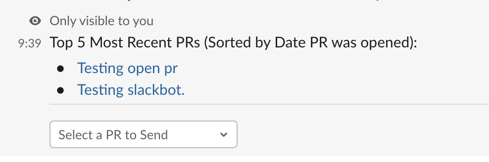

# Pull Request Slack Bot

A Slack App that lists the top N most recent PRs and gives you the ability to ask for a code review faster.

## Slash commands

- `/pr help` - list instructions on how to use this slash app

- `/pr list <repo>` - list top 5 most recent PRs from the slack username. Assuming that the slack username matches github username;

If slack and github username does not match, it will show this message

- `/pr list <repo> <username>` - list top 5 most recent PRs from the provided github username;

## ROADMAP

- [ ] Fix slash command listing such that it only shows top 5 most recent open PRs
- [ ] Fix Verification
